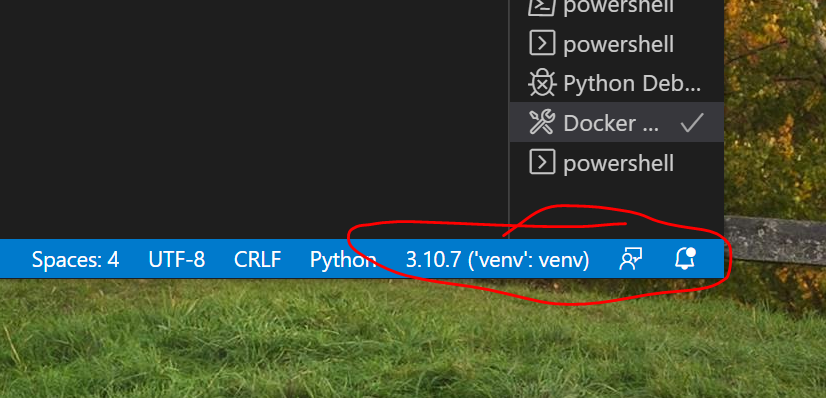

 ['add', 'bankrupt', 'bump', 'buy', 'create', 'done', 'end', 'enter', 
            'game_status', 'goto', 'info', 'list', 'load', 'next', 'pay', 'perform', 'quit', 'retire', 
            'roll', 'resolve', 'save', 'saved', 'start', 'status', 'transfer', 'use', 'use_insurance', 
            'where', 'who']# Careers
Careers Game Editions - game model and engine.

## Development Guide
Running the server locally requires mongodb and a Python Virtual Environment.

Assuming Python 3.9 is installed globally. Create a virtual environment:
```
python -m virtualenv venv
```

This will create a virtual environment called venv. Visual Studio Code (when restarted) will automatically find (and bind all python commands) to this virtual environment:



## Installing Required Packages
Run pip from a command prompt (presumably bound to the new virtual directory)
```
pip install -r requirements.txt
```

## Installing and Running Docker
Docker is used for testing the containerized version of the app. It's also used for running mongodb locally.

```
https://docs.docker.com/desktop/install/windows-install/
```
Once Docker is installed, install the following plugins for Visual Studio Code:
* Docker
* Mongodb

## Running the Containerized Version
It's easy to build the image directly from Visual Studio Code...assuming the Docker plugin is installed. Right-click on the `Dockerfile` and select `Build Image`. It will build the image `careers`, which can be launched from the command line:

```
docker run -it -p 9000:9000 careers
```
This will run the app listening on port 9000. 

## Running Mongodb
Assuming the Docker plugin is installed, right click the `docker-compose.yml` file and choose `Compose Up`.
Once it's running, you can connect to it locally using the Mongodb plugin (by connecting to `localhost`).

# Game Board Layout
The board layout and content is encapsulated in JSON files. The overall layout file is "gameLayout_\<edition\>.json" where \<edition\> is the edition name. Currently there are 2 editions: "Hi-Tech" and "UK" (the United Kingdom edition). The gameLayout file has entries for each of the game's 42 border (or edge) squares.

Each occupation and college have their own JSON file named<br> "\<occupation_name\>_\<edition\>.json". Also each occupation has a corresponding entrance square in the gameLayout file.

# Command Interface
The backend web server and GameEngine communicate via text commands and responses. The front-end UI translates player actions (for example clicking on a roll dice image) to a web server endpoint which in turn calls the GameEngine.execute_command() method with the appropriate command. <p/>

execute_command takes the command string and Player instance as arguments. If Player is None, the GameEngine uses the built-in 'admin' as the player. The commands and arguments are described in the sections below.

## Commands
Here's a list of all commands:<p>
COMMANDS = ['add', 'bankrupt', 'bump', 'buy', 'create', 'done', 'end', 'enter', 'game_status', 'goto',<br>
 'list', 'load', 'next', 'pay', 'perform', 'quit', 'retire', 'roll', 'resolve', 'save', 'saved', <br>
 'start', 'status', 'transfer', 'use', 'use_insurance', 'where', 'who']

### roll
Format: "roll" [1 | 2 ]<p>
roll takes the number of dice to use as an optional argument. If unspecified, the player's current location determines the number of dice: 2 for border squares, 1 for occupation squares.
